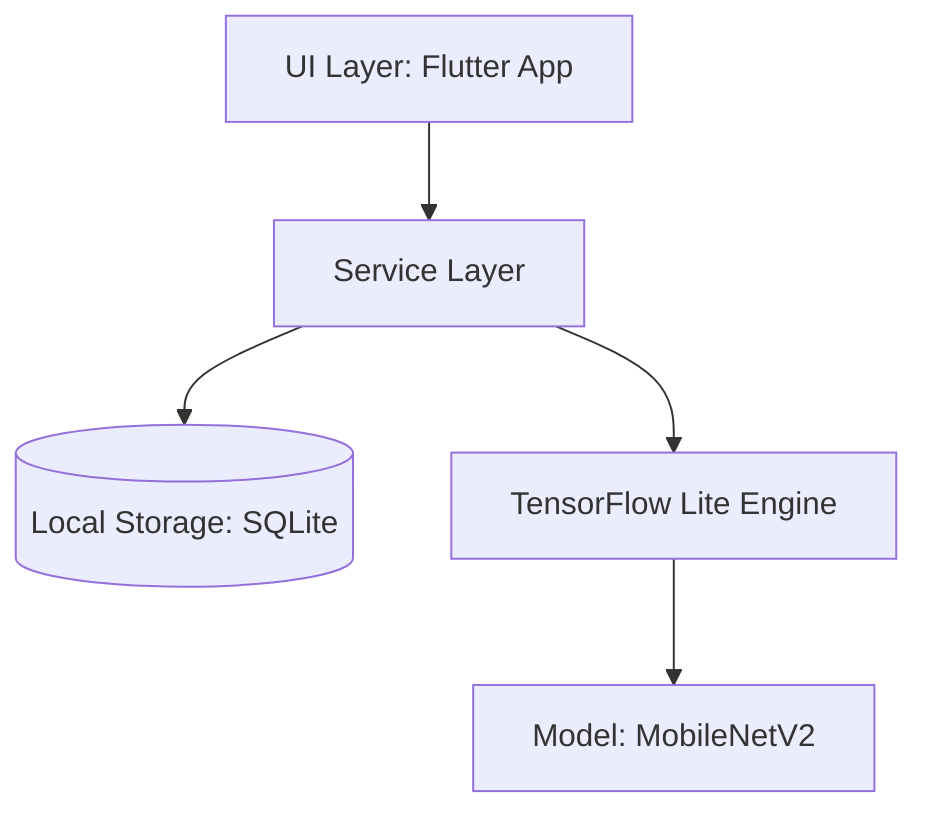
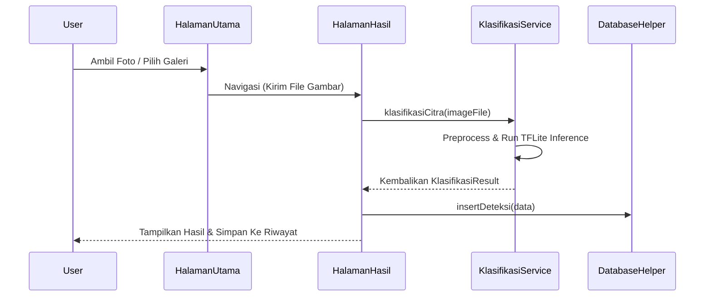
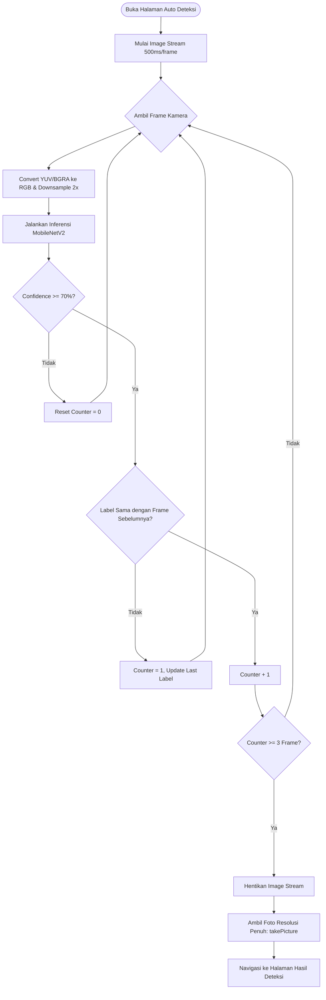

# Dokumen Desain Sistem: Egg Crack Detector

Dokumen ini menjelaskan rancangan arsitektur, basis data, alur logika, dan antarmuka aplikasi **Egg Crack Detector** berbasis Flutter dan TensorFlow Lite (MobileNetV2).

---

## 1. Arsitektur Sistem

Aplikasi ini dirancang sebagai aplikasi *on-device* murni (tanpa server backend) untuk menjaga kecepatan proses inferensi dan privasi data pengguna.

### Komponen Utama:
1. **UI Layer (Screens)**: Mengelola interaksi pengguna (Halaman Utama, Auto Deteksi, Hasil Deteksi, dan Riwayat).
2. **Service Layer**: 
   - `KlasifikasiService`: Mengelola model TFLite untuk inferensi foto statis (single image).
   - `AutoDeteksiService`: Mengelola model TFLite untuk pengolahan frame kamera secara real-time.
3. **Database Layer (`DatabaseHelper`)**: Mengelola penyimpanan riwayat deteksi menggunakan SQLite (`sqflite`).

---

## 2. Perancangan Database (SQLite)

Penyimpanan riwayat hasil deteksi dilakukan secara lokal menggunakan database SQLite bernama `egg_crack_detector.db`.

### Tabel: `hasil_deteksi`

| Nama Kolom | Tipe Data | Keterangan |
|---|---|---|
| `id` | `INTEGER` | Primary Key, Auto Increment |
| `tanggal` | `TEXT` | Waktu deteksi (format ISO8601 String) |
| `gambar_path` | `TEXT` | Path lokasi file foto telur di penyimpanan lokal |
| `hasil_klasifikasi` | `TEXT` | Hasil deteksi: `"Utuh"` atau `"Retak"` |
| `confidence_score` | `REAL` | Nilai probabilitas keyakinan model (`0.0` s.d `1.0`) |

---

## 3. Alur Kerja Deteksi & Klasifikasi

Aplikasi mendukung dua metode pengambilan citra telur: **Manual** (ambil foto / galeri) dan **Otomatis** (real-time stream).

### A. Alur Deteksi Manual

### B. Alur Auto Detection (Real-Time)
Fungsi ini mendeteksi kestabilan telur di depan kamera sebelum mengambil gambar resolusi tinggi secara otomatis.

---

## 4. Preprocessing & Inferensi Model

Model yang digunakan adalah MobileNetV2 hasil training yang menggunakan fungsi aktivasi akhir **Sigmoid** untuk klasifikasi biner.

### Spesifikasi Model:
- **Input Size**: `224 x 224` piksel dengan 3 channel warna (RGB).
- **Output**: Tensor berbentuk `[1, 1]` yang merepresentasikan skor probabilitas (rentang `0.0` s.d `1.0`).
- **Label Mapping**:
  - Skor `<= 0.5` $\rightarrow$ **Retak** (Confidence = $1.0 - \text{skor}$)
  - Skor `> 0.5` $\rightarrow$ **Utuh** (Confidence = $\text{skor}$)

### Logika Preprocessing:
1. **Downsampling (Khusus Stream)**: Frame YUV420 Android diproses dengan melompati setiap pixel ganjil (downsampling 2x) untuk mengurangi beban CPU secara drastis saat konversi format warna ke RGB.
2. **Resizing**: Gambar/frame diubah ukurannya ke `224 x 224` menggunakan interpolasi linear.
3. **Data Type**: Pixel RGB bernilai `0.0 - 255.0` dikirim langsung ke interpreter. Normalisasi ke rentang `[-1, 1]` dilakukan di dalam model oleh layer Lambda internal.

---

## 5. Perancangan Antarmuka (UI/UX)

Desain aplikasi berfokus pada estetika premium yang minimalis dan fungsional.

### Sistem Warna & Tipografi
- **Warna Utama**: Forest Green (`#163E21`) memberikan kesan profesional dan alami.
- **Warna Latar**: Warm Cream (`#FAF8F5`) memberikan kenyamanan visual dibandingkan warna putih polos.
- **Warna Aksen Status**:
  - `Utuh` / `Stabil`: Soft Green (`#4ADE80` atau `#163E21`)
  - `Retak`: Soft Red (`#FF6B6B` atau `#C84C3C`)
  - `Mencari / Loading`: Amber Yellow (`#FFD166`) / Neutral Grey (`#8C8A82`)

### Layout UI Auto Deteksi
1. **Fullscreen Camera Feed**: Tampilan kamera memenuhi layar untuk visibilitas maksimal.
2. **Guide Box (Kotak Panduan)**: Kotak di tengah layar membantu memposisikan telur secara konsisten. Corner border kotak akan berpendar (*pulsing*) saat mencari objek dan berganti warna ketika objek terdeteksi stabil.
3. **Glassmorphism Status Panel**: Panel mengambang transparan di bagian bawah menggunakan blur efek filter (`ImageFilter.blur`) untuk menampilkan status deteksi secara real-time, progress bar confidence score, dan indikator stabilitas frame (●●○).
